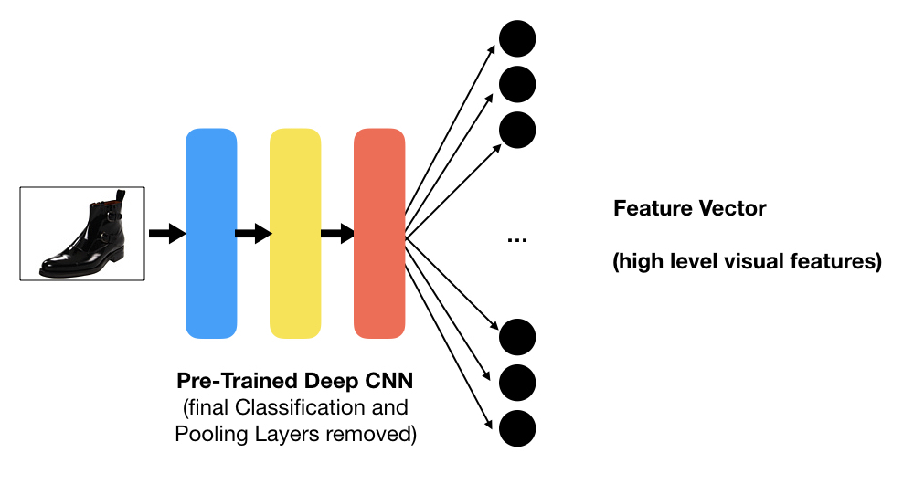
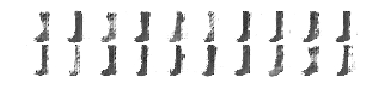
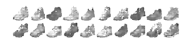
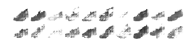
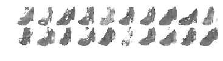
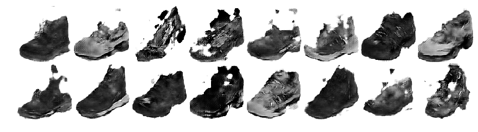
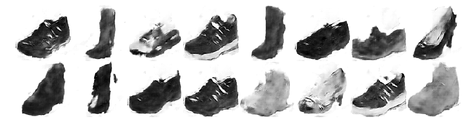
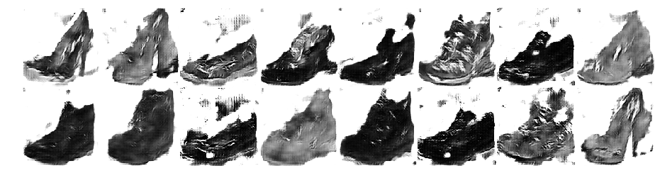
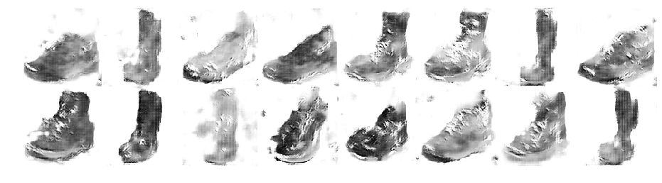

# Shoe Recommendation System and ShoeGAN

____

### No Time, SHOW ME PICTURES:

[1 - RECOMMENDATION VISUALS](https://github.com/tmgrgg/shoe-recommendation-engine/#demo-application)

[2 - GENERATION VISUALS (ShoeGAN)](https://github.com/tmgrgg/shoe-recommendation-engine/#shoegan-v03)

___

## Motivation

I have long been interested in using machine learning for the purposes of innovation and insight. One domain which I believe could be quite fruitful is in the commercial fashion industry - this project was inspired by the desire to explore this, as well as to demonstrate a level of ability in machine learning. 

In part 1, I discuss the implementation of an image-based shoe recommendation system. In part 2, I experiment with using deep learning for the more complex task of product design/generation.

___

# <b>Part 1: Recommendation</b>

The first part of the project stemmed from an exploration into the application of deep learning in e-commerce and recommendation systems, demonstrating an innovative approach to a business problem.

## The Problem

Suppose either we're a new e-commerce business, or an e-commerce business with a totally new line of products. When users visit our site and shop around for goods, we want to be able to recommend them items we think they'll like based on their viewing activity. This is analogous to how high street retailers lay out goods to make it easier for people to find what they are looking for and therefore make a purchase.

For the purposes of this project, I took the perspective of a <b>new e-commerce business selling shoes</b>.

### Collaborative Filtering

The industry standard approach for this problem is to implement either user-user or item-item based collaborative filtering. This means we recommend items to a user based on user's behavioural similarity with respect to the content/items they view or purchase. However, this requires a rich history of user behaviour and interaction with our marketplace in order to set up. This works for established sites like Amazon, eBay, ASOS etc. but it is not an effective strategy for a new business or new line of products, as there is unlikely to be sufficient data.

### Content-based Filtering

Content-based filtering relies on measuring the similarity of items based on the item's content. This can be done without user data, but relies on choosing a sensible and considered measure of item similarity. In our case, when suggesting shoes to a customer, a bad choice would be to base our similarity measure purely on colour, as then a user searching for a black boot may find themselves being recommended a black high heel. A better choice would probably be to recommend based on type, style, colour, and textures/patterns. I built this recommendation system using a combination of explicit meta features for each shoe, and content derived with deep learning from the product's image.

## Demo Application

Below is a gif displaying the simple app I built to demonstrate this image-based recommendation algorithm in action. Here's a [YouTube link](https://youtu.be/BPpdEfH10ao) in case the gif isn't working properly.

Steps for running the application are as follows:

1. Clone this repository.

2. Download the files in [this drive folder](https://drive.google.com/open?id=1vKgJSd2IpW1zfDVQGK6_wW4WptFd3lr6), and place them all in a sub-folder named 'data' within the locally cloned repo.

3. Run the following command in terminal within the cloned directory: `python app.py` or `python3 app.py` to be sure you're using Python 3.

<b>Warning:</b> The application may take a minute or so to boot up because of the necessary precomputations.

## How Does It Work?

Each image can be represented as a point in feature space: for example, a roughly 300x100 pixel image with 3 colour channels can be plotted as a point in a space with 90,000 dimensions. For a given image, we can then see which images lie closest to it in space - exactly as we would in 1, 2 or 3 dimensions, forming a similarity measure.

### Problems

If we do as stated above and choose to plot our images in the feature space corresponding to their pixel values, then there are two main problems:

1. The space is huge (90,000 dimensions) and therefore computationally expensive to work in.
2. The images that are closest in this feature space will be overly sensitive to individual pixels and will not be representative of larger local or global similarities present in the image.

### Transfer Learning

What I instead chose to do was to take a deep network that had been pre-trained on a huge dataset of all sorts of objects and to use its final hidden layer as a feature vector. This is not the traditional use of transfer learning, instead the transferred network acts as an out-of-the-box local and global visual feature detector. The transferred network is able to detect all sorts of shapes, colours, patterns and textures and encode them into its output layer for use as a feature vector.

The transfer network feature vector ended up having 4096 values, and so describes a 4096-dimensional space. This is a vast improvement over the 90,000 dimensions we were working with in pure pixel data. The transfer network layer's feature space does a good job of finding similar shoes based on shape, colour, texture, pattern and even branding as can be seen in the above demo application.

### Issues

The primary issue with performing content-based filtering over collaborative filtering is that there is no past data to use to quantify the effectiveness of our recommendation model. We therefore have to resort to AB testing for content-based recommendation, though this is beyond the scope of what I tried to do in this project (primarily because I don't actually own an e-commerce business).

A real business would most likely benefit from using these methods when starting out, before transitioning to more traditional collaborative filtering models once they have acquired suitable amounts of data.

___

# <b>Part 2: Generation</b>

This extension of the project came about by asking the question: what if the perfect shoe that I'm looking for in this 'shoe space' does not exist? Since the recommendation system sees every shoe as just a point in 'shoe space', then could we work backwards and go from a point in 'shoe space' to a shoe whose image would actually occupy this point? This would be analogous to the process of creative design!

This part of the project is very much a WIP. As of yet I am primarily making use of unconditional generative models to show that it is possible for a machine to generate viable product designs, at least in theory.

## Approach

I generated new shoe designs using a Generative Adversarial Network through extensive experimentation with different architectures and hyperparameters. These binary systems of neural networks are a recently developed approach for generation. For those interested, they are well documented in the original paper [Generative Adversarial Networks by Goodfellow et al.](https://arxiv.org/abs/1406.2661) - I also used [Unsupervised Representation Learning with Deep Convolutional Generative Adversarial Network](https://arxiv.org/abs/1511.06434) for reference in order to develop more sophisticated architectures.

## Demo Images

You can run and train an iteration of ShoeGAN yourself using one of the clearly labelled `.ipynb` files in this repository, although be warned that it will be quite time consuming. I have included images of versions of ShoeGAN's output below for reference.

### ShoeGAN v0.1

The earliest version of my Generative Adversarial Network for images of shoes used a very simple architecture and was trained on low-resolution greyscale images, just as a quick proof of concept:

*<b>Boots</b> by ShoeGAN v0.1*

*<b>Sneakers</b> by ShoeGAN v0.1*

*<b>Shoes</b> by ShoeGAN v0.1*

*<b>Heels</b> by ShoeGAN v0.1*

As can be seen in the images, they are reminiscent of low-resolution examples of each class of shoe, albeit with a lot of noise.

### ShoeGAN v0.3

This version of ShoeGAN was trained on higher resolution greyscale images and used a more powerful (and less stable) architecture, resulting in images that were less consistent but more detailed and interesting:

*More realism with details such as laces and texture present here*

*A number of sneakers and a clear heel with insole (top right)*

*Here we can see a few (noisy) low-cut boots and heels*

*This image is from an earlier training epoch, interesting to note the details and overall sketch-like qualities*

___

## Future Work

I am currently working on stabilising the most recent version of ShoeGAN so that it is able to learn to generate realistic images of new shoe designs. Stay tuned!
